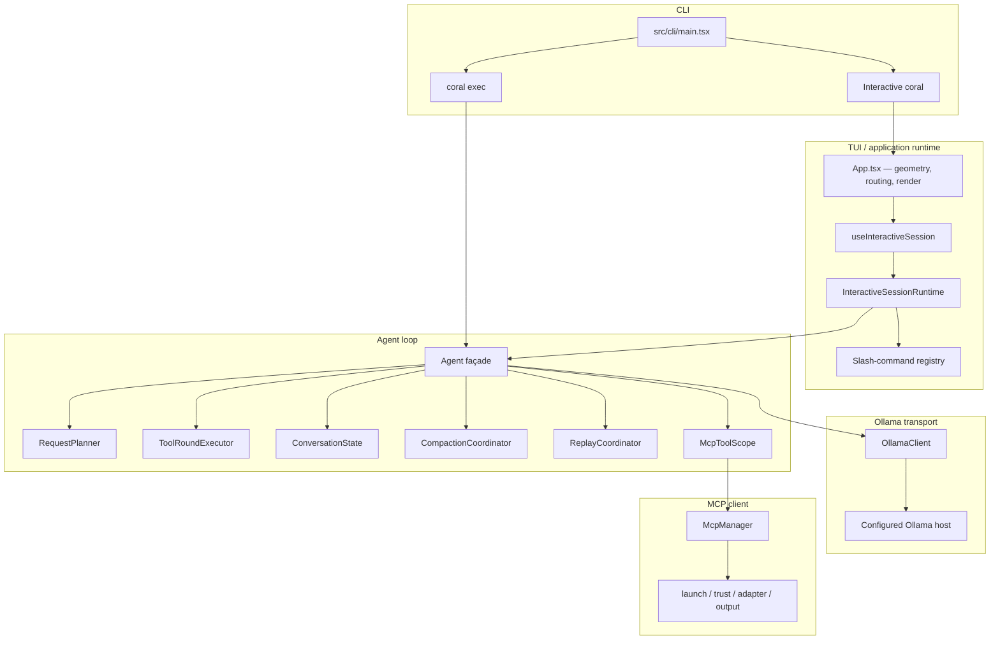
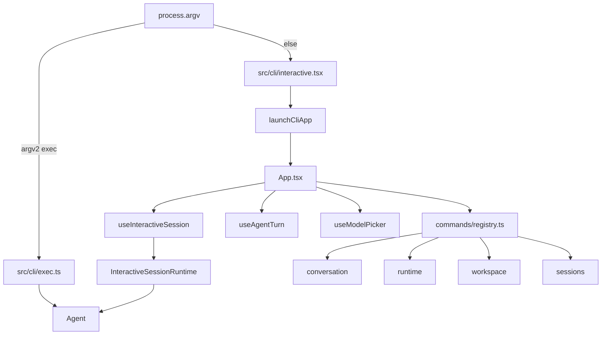
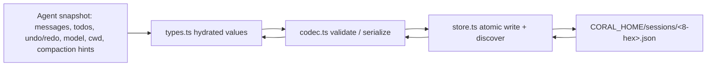
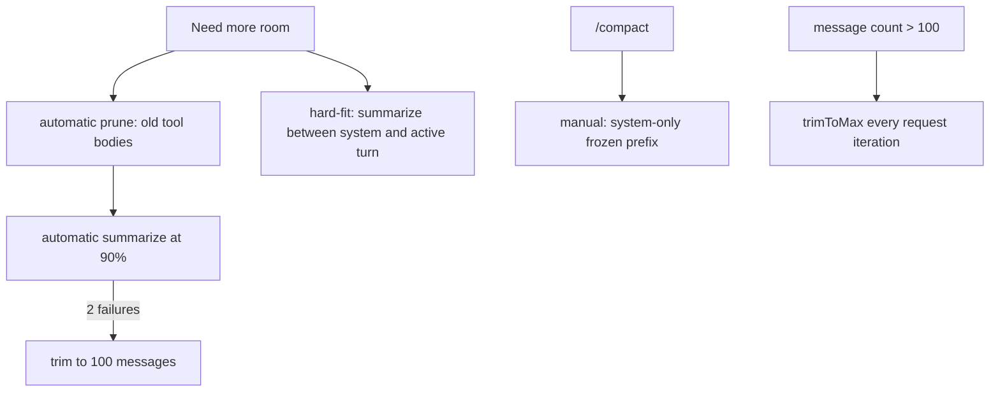

# Coral architecture

This is the systems document for Coral: what it is, how a turn actually runs, who owns which state, and what the product deliberately does not do.

It is written for people who run Coral and want to understand the machine. It is not a contributor onboarding dump and not an internal planner. Implementation trivia (ESM `.js` import suffixes, test doubles) appears only where it explains a boundary you can observe.

Related how-tos: [Getting started](getting-started.md), [CLI](cli.md), [TUI](tui.md), [Configuration](configuration.md), [Permissions](permissions.md), [Tools](tools.md), [MCP](mcp.md), [Sessions](sessions.md), [Context](context.md), [Troubleshooting](troubleshooting.md).

---

## What Coral is

Coral is a **local-first coding agent** that runs in your terminal. You type a request. Coral streams a model response from **Ollama**, detects tool calls, executes them against your workspace (and optionally against MCP servers you configured), feeds results back, and loops until the model is done or you interrupt.

That loop — stream, tools, settle, repeat — is the product. Conversational Q&A works, but the design assumes a capable local model doing coding work: reading a repo, editing files, running commands, using Git, searching by text or meaning, and keeping a multi-turn session.

Facts that follow from that:

- **Inference is Ollama-only.** Every chat request goes to the host you configure (`http://localhost:11434` by default). There is no built-in cloud inference API and no provider matrix.
- **No remote telemetry.** Reliability counters stay in files under `CORAL_HOME` (default `~/.coral`). Coral does not upload them.
- **MCP is an extra data boundary you opt into.** Local stdio subprocesses you define in `~/.coral.json` may reach files, the host, or remote APIs according to _their_ behavior. Coral does not sandbox them.
- **Coding agent, not chatbot wrapper.** The model sees a structured tool catalog, a system prompt that lists those tools as exhaustive, Git snapshots at request time, optional `@` file attachments, and conversation history that Coral compact/prune/trims when the window fills.

Coral currently targets **large local models** (the startup picker prefers `gemma4:31b-mlx` when that tag is installed). Small models can run; prompts and tools are not dumbed down for them.

Package version at the time of this writing is `0.14.0`. Node.js `>=24` is required. The supported install surface is the `coral` executable (from a source checkout: `npm run dev` or `npm start` after `npm run build`). There is no supported JavaScript API.

---

## What Coral is not

- Not a multi-provider agent (OpenAI / Anthropic / …). The `AgentInferenceClient` seam is an Ollama-shaped test/runtime injection point. Production constructs `OllamaClient`.
- Not a remote-hosted service. The process on your machine owns the TUI, the Agent, tools, and local files.
- Not a hostile-process sandbox. `bash` and MCP servers run as ordinary host processes. Headless permission profiles are **deterministic tool catalogs**, not isolation.
- Not an IDE. TypeScript/JavaScript code intelligence is a bundled language-server tool (`code_intel`), not an editor.
- Not a session sync or collaboration product. Sessions are whole-file JSON on disk; concurrent saves of the same ID are last-writer-wins, not merged.
- Not a plugin/extension host. Built-in tools are a static registry; the only dynamic tools are MCP tools you allowlist.

---

## Four layers

Coral is four layers with strict ownership. Each exists so a different kind of change stays local: swap the HTTP client without rewriting history; change the TUI without rewriting the Agent; add an MCP server without teaching subagents about it.

The mermaid below also shows the **CLI dispatcher** (`src/cli/main.tsx`) and the MCP helpers behind the manager. Those are not extra runtime layers. Session persistence sits **beside** the four layers (types / codec / store), not inside the Agent.

### 1. Ollama transport

`src/ollama/client.ts` is the REST client. It streams `POST /api/chat` as NDJSON, lists models via `/api/tags`, resolves model metadata for context pinning, and (separately from the Agent chat loop) embeds text for semantic search.

The Agent does not depend on that whole class. It consumes `AgentInferenceClient` in `src/agent/inference-client.ts`: `startKeepAlive`, `showModel`, `listModels`, `chatStream`. Production still does `new OllamaClient(baseUrl)` unless a test injects a double.

Default host is `http://localhost:11434`. URLs must be `http` or `https`, with no credentials, query string, or fragment. Trailing slashes on the path are stripped.

Chat requests send `keep_alive: '10m'` unless a caller overrides `ChatRequest.keep_alive`. They also send `options.num_ctx` (the pinned window) and `options.num_predict` (the request's response reserve). Streamed reasoning uses Ollama's `think` field when the Agent think flag is on. `--no-think` still sends `think: false`; it does not omit the field.

If `/api/chat` returns HTTP **400, 404, or 422** and the error body mentions `think` or `unknown field`, the client retries **once** without `think` and caches that the model does not support it. Other rejections are not retried.

`startKeepAlive(model)` only remembers `lastModel`. It does **not** send a keep-alive request. `evictModel` POSTs `keep_alive: 0`; Agent `dispose()` never calls it, so a loaded model stays on the Ollama host after Coral exits.

The client concatenates consecutive leading `system` messages into one wire system message (prompt + optional Git context). Frozen compaction handoffs are **user** messages, so they are not coalesced. Coral never adds Ollama's `format` field on tool-bearing requests because that drops `tool_calls`.

This layer exists so HTTP, NDJSON, and Ollama quirks do not leak into conversation state.

### 2. Agent loop

`src/agent/agent.ts` is the stable façade. It admits one turn at a time, streams the model, commits protected history, owns model/resource lifetime (MCP scope, optional LSP process, todos), finalizes undo records, and exposes snapshots the session layer can persist.

It **delegates** work it must not own:

| Collaborator            | Owns                                                                                                                 | Must not                                                |
| ----------------------- | -------------------------------------------------------------------------------------------------------------------- | ------------------------------------------------------- |
| `RequestPlanner`        | Exact request bytes: system fit, git/project degrade, attachment fit, tool-result reservation                        | Conversation mutations, compaction commits              |
| `ToolRoundExecutor`     | One catalog snapshot: name repair, approval, parallel/serial execution, staged results                               | History commits (Agent pushes messages after the round) |
| `ConversationState`     | Stored messages, token estimates, frozen compaction prefix, active-turn anchor, undo/redo stacks, compaction metrics | Filesystem I/O, inference, MCP                          |
| `CompactionCoordinator` | Prune / summarize / hard-fit / trim via revision-checked plans                                                       | Direct history edits that skip the state API            |
| `ReplayCoordinator`     | Undo/redo across messages, files, and todos, fail-closed                                                             | Compaction                                              |
| `McpToolScope`          | Mode, lazy manager identity, bootstrap, admission, retirement                                                        | Conversation state                                      |

Public callbacks live on `AgentEvents` in `src/agent/contracts.ts` (`onToken`, `onThinking`, `onToolCall`, `onToolResult`, `onToolApproval`, `onMcpLaunchApproval`, `onDoomLoop`, `onVerification`, `onUsage`, `onAttachments`, `onCompactionStart`, `onCompaction`, `onDone`, `onError`). Semantics that are easy to misread: `onCompactionStart` is summarization-only (not prune); `onAttachments` fires only after the user message is committed with a materialization; `onUsage` is Ollama token counts plus nanosecond durations; `onVerification` is warn-only with one retry on FAIL.

This layer exists so the TUI is not the source of truth for history, and so compaction/undo cannot commit stale work.

### 3. TUI / application runtime

The Ink UI is not the Agent.

- `InteractiveSessionRuntime` (`src/tui/session/interactive-runtime.ts`) is **framework-neutral**. It owns Agent generations, one active operation (`turn` or `command`), one lifecycle transition (`model`, `permission`, or `session`), blocking prompts (`tool`, `mcp`, `doom`), session binding, persist-on-complete, and Agent retirement. Process signals are handled by the React hook plus `src/tui/shell/shutdown.ts`.
- `useInteractiveSession` adapts that authority into React: construct/switch/resume Agents, MCP ask/yolo, persist/rename/clear, SIGINT/SIGTERM.
- `useAgentTurn` projects Agent events into the transcript and run stage.
- `useModelPicker` owns model discovery and selection presentation.
- `App.tsx` retains terminal geometry, top-level input routing, modal composition, and rendering.
- Slash commands are four feature bundles plus `/help`, registered in a **fixed order** in `src/tui/commands/registry.ts`.

`src/cli/main.tsx` is a tiny dispatcher: if `argv[2] === 'exec'`, run headless; otherwise parse interactive flags with commander and render `<App>`. Interactive `--help` therefore does **not** list `exec`. Use `coral exec --help`.

This layer exists so Ink/React can be swapped or tested without rewriting the Agent, and so only one turn, command, or transition runs at a time.

### 4. MCP client

Each **primary** Agent owns one `McpToolScope`. Interactive sessions pass MCP mode `ask` or `yolo` (never `off`). Subagents, the Agent constructor default, and `coral exec` without `--mcp` use `off`.

The scope is the only production site that dynamically imports `McpManager`. The manager owns policy preflight, launch trust, discovery/admission budgets, **serialized** tool calls, status, rollback, and subprocess lifetime. Helpers stay behind that lazy entry:

- `src/mcp/launch.ts` — executable, env, diagnostics (no shell)
- `src/mcp/tool-adapter.ts` — strict schemas → Coral `Tool`s
- `src/mcp/output.ts` — sanitize, redact, bound results
- `src/mcp/trust.ts` — fingerprints on disk

This layer exists so MCP SDK cost is not paid when MCP is off, and so yolo cannot invent trust or extra tools.

### Session persistence (beside the four layers)

Not a fifth runtime layer, but a separate disk contract:

| Module                 | Job                                                               |
| ---------------------- | ----------------------------------------------------------------- |
| `src/session/types.ts` | Hydrated public values (`SessionData`, `SessionMeta`)             |
| `src/session/codec.ts` | Untrusted-bytes validation and serialization                      |
| `src/session/store.ts` | Paths, discovery, atomic whole-file writes, multiwriter semantics |

Codec owns “is this JSON a session?”. Store owns “where does it live and how is it replaced?”.

---

## End-to-end turn

What happens when you type a prompt and press Enter.

```mermaid
sequenceDiagram
  participant User
  participant App as TUI / runtime
  participant Agent as Agent façade
  participant State as ConversationState
  participant Planner as RequestPlanner
  participant Ollama
  participant Round as ToolRoundExecutor
  participant Store as Session store

  User->>App: prompt, optional @paths
  App->>Agent: acceptTurn + runAcceptedTurn
  Agent->>State: acceptUserMessage (anchor)
  Agent->>Agent: pin context window
  Agent->>Agent: initialize MCP for this mode
  Agent->>Planner: fit system prompt to budget
  Agent->>Agent: capture @ attachments
  loop until model finishes, errors, or abort
    Agent->>Planner: planModelRequest (history, git, tools)
    Planner-->>Agent: messages + budget or needs compaction
    Agent->>Ollama: chatStream
    Ollama-->>App: tokens / thinking
    alt model emitted tool_calls
      Agent->>Round: prepare (catalog snapshot)
      Round->>User: approval prompt if require_approval
      Round-->>Agent: staged results + diffs / undo changes
      Agent->>State: commit assistant + tool messages
    else empty / invalid tool-shaped text
      Agent->>Ollama: stall nudge or repair reprompt
    else final assistant text
      opt verifyEdits and edits exist
        Agent->>Agent: read-only self-check subagent
      end
      Agent->>State: finalizeActiveTurn (undo record)
    end
  end
  App->>Store: persist session snapshot
```

### 1. Input

- Plain text starts a turn.
- Lines starting with `/` are slash commands and are **not** sent to the model.
- `@path` or `@"quoted path"` mentions are parsed on submit. The runtime passes `attachmentPaths` into `acceptTurn`. Coral reads those files only after the context window and tool budget are known, then fits them in mention order against the same whole-request limit as history, tools, Git context, and the reserved response.

### 2. Admission

`acceptTurn` refuses a second in-flight turn (`Agent already has an accepted turn`). `ConversationState.acceptUserMessage` records the user message and an opaque **anchor**. `runAcceptedTurn` joins cancelable enrichment to that receipt.

### 3. Before the first model call

In order:

1. **Pin `num_ctx`** for this Agent/model (`fetchContextWindow`). The value stays until `/model`. See [Context](context.md).
2. **Bootstrap MCP** for the current mode (`initializeMcp`). Ask may prompt launch trust. Yolo never prompts; untrusted servers stay `needs_trust`. Interactive MCP tools appear on this turn, not at process start.
3. **Fit the system prompt** so identity, tools, and project files fit the budget.
4. **Capture attachments** (skip missing, binary, oversized, outside workspace, or over budget).

### 4. Each iteration

- Rebuild **Git context** (request-only; not stored in history). If the cwd is not a git work tree, it is omitted.
- **Compact if needed** (prune old tool results, then summarize; fail-twice trim; plus a 100-message guard). See [Context](context.md).
- `RequestPlanner.planModelRequest` builds the exact messages/tools payload. If it does not fit: compact git → drop git → strip project context → hard-fit history compaction → fit attachments. Overflow of protected history or fixed cost becomes a `RequestBudgetError` (`fixed_cost_overflow` or `history_overflow`) surfaced as `onError`.
- `chatStream` to Ollama. `thinking` chunks → `onThinking`. `content` → `onToken`. `tool_calls` are merged by function index.

### 5. Tool settlement

If the model emitted tool calls:

- `ToolRoundExecutor.prepare` snapshots the catalog, retries names after lowercasing and stripping non-alphanumerics (`Read_File` / `READFILE` → `read_file`; no edit-distance match), and may omit arguments larger than **2,048 tokens** from **stored** history (the live call still sees full args).
- `execute` runs the round. Parallel only when the tool is `parallelSafe` **and** the resolved policy is `always_allow`. Workspace-escaping paths promote `always_allow` to `require_approval`. MCP calls are serial at the manager.
- Results are **staged** before UI callbacks so a throwing `onToolResult` cannot drop a mutation that already happened.
- Agent then `pushMessages` assistant + tool results after a budget check.

The loop continues.

### 6. Completion, interrupt, persistence

- A tool-free assistant message ends the turn (after optional edit verification).
- Interrupt (`Ctrl+C` / `Esc` during a run) aborts. Streamed assistant text is kept. If only reasoning streamed, Coral stores an assistant message with content `(interrupted)` and that thinking. If **neither** content nor thinking arrived, history is unchanged. The TUI still appends `Generation interrupted`.
- Empty model turn (no content **and** no thinking): up to **2** stall nudges — _Your last turn was empty. Call a tool to make progress, or give your final answer as plain text._
- Tool-shaped invalid text: **1** reprompt — _That looked like a tool call, but it wasn't valid…_
- If `RequestPlanner` still cannot fit after degrading Git and project context, it returns `needs_history_compaction`. The Agent then runs **hard-fit** summarization of everything between the system message and the active user turn, then retries the plan. Protected history that still overflows becomes `RequestBudgetError`.
- `finalizeActiveTurn` records an undo turn (messages, file changes, todo change), caps at 10, and **clears redo**.
- `InteractiveSessionRuntime.completeTurn` always attempts an atomic session write for that turn (`persistence`: `saved` / `error` / `not_attempted`). The React adapter's `persistCurrent` (slash commands) skips when there are zero non-system messages **and** no bound session id (`status: 'empty'`). `stale` means the Agent is already closing.

Headless `coral exec` runs the same Agent loop once, never creates a Coral session, and rejects every interactive approval. `--ephemeral` is registered by commander and unused; exec never persists either way.

---

## Who mutates what

This is the ownership rule that keeps compaction, undo, and MCP from racing.

| Component                     | Mutates                                                                                                                               | Does not mutate                                                        |
| ----------------------------- | ------------------------------------------------------------------------------------------------------------------------------------- | ---------------------------------------------------------------------- |
| **Agent**                     | Admission, which collaborator runs, tool catalog rebuild after MCP admit, `numCtx`, think/verify flags, reliability counters, dispose | Direct surgery of the message array (goes through `ConversationState`) |
| **RequestPlanner**            | Nothing durable — plans from a snapshot                                                                                               | `ConversationState`, files, MCP                                        |
| **ToolRoundExecutor**         | Host files/processes via tools; staged round outcomes                                                                                 | History (Agent commits after execute)                                  |
| **ConversationState**         | Messages, frozen prefix, anchors, undo/redo, revision, compaction counters                                                            | Disk, Ollama, MCP processes                                            |
| **CompactionCoordinator**     | History **only** by committing revision-checked plans                                                                                 | Files; must not apply a stale plan                                     |
| **ReplayCoordinator**         | Files + todos + history via `commitReplay`                                                                                            | Compaction prefix (undo is refused after compaction)                   |
| **McpToolScope**              | Mode, manager identity, admitted dynamic tools                                                                                        | Conversation messages                                                  |
| **InteractiveSessionRuntime** | Which Agent is current, session binding, prompts, shutdown                                                                            | Message contents (reads Agent snapshots)                               |
| **Session store**             | Files under `CORAL_HOME/sessions/`                                                                                                    | Live Agent memory except via load/restore                              |

`ConversationState.touch()` bumps a revision on every mutation. Compaction and undo plans carry that revision; a stale plan returns `{ status: 'stale' }` and does not commit. Summarize, hard-fit, trim, `/compact`, and `/clear` **clear undo/redo**. Tool-result **prune** does not (it rewrites tool bodies in place and leaves stacks aligned). Undo refuses “after compaction or history changes” and “after concurrent history changes”.

---

## The tool-use loop is the core primitive

Extending Coral means extending this loop: more tools, better selection, richer context — not a second chat path.

One round:

1. Model streams text and/or `tool_calls`.
2. Coral validates names and JSON arguments. Name repair is lowercase + strip separators, not fuzzy matching.
3. Policy: `always_deny` → error to the model; `require_approval` → TUI prompt (or auto-true in yolo); `always_allow` → run, unless a workspace path escapes and is promoted.
4. Execute. Capture diffs for the TUI (not sent back to the model). Capture `change` / `todoChange` for undo.
5. Bound the result (~100,000 characters) and, if needed, omit it to fit the next request.
6. Append assistant + tool messages. Repeat.

If the model returns an empty turn, Coral injects a stall nudge (up to 2). If the text looks like a tool call but is not valid JSON, Coral reprompts once. Repeated identical calls or errors (3 in a window of 12) trip a **doom loop**: the TUI asks `(y) continue  (n) stop`; `coral exec` stops.

Built-in tools are listed in the system prompt as **exhaustive**. Project files (`.coral.md`, `AGENTS.md`, …) cannot grant a tool that is not in the catalog.

---

## Tool system

### Interface

A tool (`src/tools/tool.ts`) has `name`, `description`, JSON Schema `parameters`, and `execute` returning `{ output, error?, diff?, change?, todoChange?, repaired? }`.

- `diff` is TUI-only; the model never sees it.
- `change` / `todoChange` feed `/undo`.
- Optional `subagentSafe` / `parallelSafe` are **authority only on trusted built-ins**. Dynamic MCP tools cannot set them in a way the catalog honors.

### Registry vs catalog

- `src/tools/registry.ts` `allTools` is the executable list (order preserved). Startup asserts exact name coverage against `builtInToolRegistrations`.
- `src/tools/catalog.ts` holds **host-owned** default policy and workspace-path rules. Each Agent builds an immutable `ToolCatalog` (trusted tools + optional dynamic MCP tools) that derives lookup, Ollama schemas, token cost, and capability flags.

Adding a built-in means both files. MCP tools are never added to `allTools`.

### Built-in names

`read_file`, `write_file`, `edit_file`, `grep`, `glob`, `list_files`, `search_code`, `code_intel`, `bash`, `git_status`, `git_diff`, `git_log`, `git_add`, `git_commit`, `git_switch`, `git_push`, `task`, `todo_write`.

Default policies and path rules: [Tools](tools.md) and [Permissions](permissions.md).

### Built-in vs MCP

|                                 | Built-in                  | MCP                                       |
| ------------------------------- | ------------------------- | ----------------------------------------- |
| Source                          | Static registry           | Discovered after launch                   |
| Name                            | Exact built-in            | `mcp__<alias>__<tool>`                    |
| Default policy                  | Per-tool in catalog       | `require_approval` (unknown-name default) |
| `subagentSafe` / `parallelSafe` | If the tool sets them     | Always false in the catalog               |
| Workspace path rule             | Some tools                | Never                                     |
| Yolo                            | Same as other gated tools | Only `yoloTools` + current trust          |
| Subagents                       | Nine read-only tools      | Never (`mcpMode: 'off'`)                  |

MCP tools cannot claim a built-in name (after normalization). They cannot self-grant workspace-path handling, parallel execution, or subagent eligibility.

### Todos

`AgentTodoState` is per primary Agent, injected into `todo_write`, snapshotted into the session, rendered in the TUI, and undone with the turn. There is no process-global todo store. Subagents get a fresh unused list and cannot call `todo_write`.

### `task` subagents

`task` runs a **read-only child Agent** with a 24-iteration cap, shared LSP client, inherited `num_ctx`, `mcpMode: 'off'`, `verifyEdits: false`, and tools limited to `read_file`, `grep`, `glob`, `list_files`, `search_code`, `code_intel`, `git_status`, `git_diff`, `git_log`. Unexpected `require_approval` calls are denied (no prompt). `task` itself is not subagent-safe (no recursion). The optional `description` argument is display-only; only `prompt` is forwarded.

---

## MCP lifetime (architecture view)

Modes (`src/mcp/types.ts`): `'off' | 'ask' | 'yolo'`.

- **ask** — admit `enabledTools` (minus `always_deny`). First/changed launch identity can prompt. If any configured server is still `needs_trust` after initialize, Coral admits **no** MCP tools (fail closed).
- **yolo** — admit the intersection of `enabledTools` and `yoloTools`, and only if the current fingerprint is already trusted. Launch approval callback is not used; missing trust stays `needs_trust`. TUI `onMcpLaunchApproval` returns false in yolo.
- **off** — no manager load. `/mcp` reports `MCP is disabled for this Agent` for those servers.

Switching ask ↔ yolo **synchronously** drops the old dynamic catalog and prompt capabilities, retires processes, and builds a fresh mode-specific manager on the **next chat turn**.

Config is **user-only** (`~/.coral.json`). Project `.coral.json` cannot define servers, add enabled tools, or grant yolo eligibility. Details: [MCP](mcp.md).

---

## LSP / `code_intel`

Each interactive Agent constructs one `TypeScriptCodeIntel` (`src/lsp/client.ts`) unless a test injects a service. The bundled `typescript-language-server` starts on **first query**, not at construction.

- Operations: `definition`, `references`, `hover`, `diagnostics`.
- Files: `.ts`, `.tsx`, `.mts`, `.cts`, `.js`, `.jsx`, `.mjs`, `.cjs`.
- Read-only: `workspace/applyEdit` is rejected (`Coral code intelligence is read-only`).
- Subagents **borrow** the same client (`ownsCodeIntel === false`) so dispose of a child does not kill the server.
- Primary `dispose()` stops the server when the Agent owns it.

No other languages, no rename/refactor, no workspace-wide diagnostic sweep.

Timeouts: 30s startup, 15s requests, 5s diagnostics (150ms debounce), 2s shutdown, 500ms process-exit wait. At most **2** start attempts. If diagnostics are not published in 5s, the tool tells the model to run the project typecheck; Coral does not run it.

---

## TUI stack vs CLI

**App retains:** columns/rows, palette open, prompt text, thinking **visibility**, theme generation, command-running flag, transcript scroll, header (`coral · model · ask|YOLO`, then `session {id}` only when bound, then `{n} messages` only when count > 0), welcome vs transcript, todo panel (max 8 rows), approval box, status line.

**Runtime retains:** the live Agent, generation numbers so stale events are ignored, session id/meta. Turn completion persistence is `'saved' | 'error' | 'not_attempted'`. Slash-command `SessionSaveResult` is `'saved' | 'empty' | 'error' | 'stale'`. SIGINT/SIGTERM are owned by the React hook plus `src/tui/shell/shutdown.ts`, not by the runtime class itself.

Slash-command **order** is mixed across the four bundles (`help`, then conversation/runtime/workspace/sessions interleaved) and is fixed in `src/tui/commands/registry.ts`. `/help`, `/` completion, and the palette all use that order. Palette titles are canonical names (`/permissions`, not `/perm`).

**Headless** constructs an Agent with a profile tool list, always-reject approvals, `verifyEdits: false`, think left at Agent default (`true`), and `mcpMode: 'ask'` only if `--mcp` (still reject launch/tool prompts). It never calls the session store.

| Profile               | Tools (`always_allow` inside the profile)                                                                                                  |
| --------------------- | ------------------------------------------------------------------------------------------------------------------------------------------ |
| `read-only` (default) | The nine `subagentSafe` tools: `read_file`, `grep`, `glob`, `list_files`, `search_code`, `code_intel`, `git_status`, `git_diff`, `git_log` |
| `workspace-write`     | Those plus `write_file`, `edit_file`, `bash`                                                                                               |

**In neither profile:** `git_add`, `git_commit`, `git_switch`, `git_push`, `task`, `todo_write`. Unexpected tools and every approval prompt are rejected. `--ephemeral` does nothing.

---

## Session persistence

**ID:** 8 lowercase hex characters (`randomBytes(4)`). Filename must match `meta.id`. Discovery scans `*.json`; a legacy `sessions/index.json` is not read or written.

**Persisted:** `meta` (id, model, cwd, timestamps, title, non-system `messageCount`, optional compaction fields), messages (roles, content, optional display/thinking/tool fields/attachment report), todos, undo, redo.

**Not persisted:** think flag, ask/yolo, `/verify` toggle, pinned `num_ctx`, Ollama token totals, reliability counters (those flush to telemetry files when an **interactive** Agent that produced a turn is closed), MCP processes, theme (prefs file), prompt history (separate JSONL).

Restore keeps the **current** system prompt (this model, these tools), not the saved system message. Undo/redo stacks are restored when present. `/clear` unbinds **without** rewriting the file. `/new` saves first; on save `error`/`stale` it **does not** start a new conversation. There is no delete-session command.

Writes are unique same-directory temp files then rename, mode `0o600`. Same-ID concurrent saves do not merge. Undo JSON in the session file is capped at **8 MiB**; aligned undo may omit redundant `messages` and rehydrate from history; redo always stores messages.

Secrets in edited files can be duplicated in undo snapshots. Treat `CORAL_HOME/sessions/` like the workspace.

---

## Context window

Coral pins one `num_ctx` per Agent+model so Ollama does not reload the runner between turns.

Formula (`src/config/context.ts`):

1. Read native context length from Ollama `showModel`.
2. Estimate weights from `/api/tags` `size` (missing → 0).
3. Memory cap: `0.75 × total RAM − weights − 6 GiB` for KV. Sliding-window architectures (`gemma`, `gemma2`, `gemma3`, `gemma4`) and unknown KV dims are treated as KV-light and pin **native** after the weight check. Full-attention models divide remaining bytes by estimated f16 KV bytes/token and round down to 1024.
4. Apply user ceiling: `CORAL_NUM_CTX` if it parses as an integer `> 0`, else project `.coral.json` `context.maxNumCtx` (number only; strings ignored).
5. Clamp: `min(native, max(8192, min(memoryCap, ceiling)))`. If native is **smaller** than 8192, the pin is native. A tiny `CORAL_NUM_CTX` (for example 512) still floors at 8192 unless native is smaller.

`/model` zeros the pin and resolves again. Subagents inherit the parent's `num_ctx`. The pin is not stored in the session file.

The pin is what Ollama allocates for KV. **Request budgeting is a separate, tighter cap** (`src/agent/request/budget.ts`):

- Response reserve: about **1/8** of the window, capped at **16,384** tokens (`num_predict`).
- Prompt limit: `window − responseReserve`, then capped at **32,768** tokens. A 128k native pin does not mean Coral sends a 128k prompt.
- Summary calls use a smaller response reserve (cap **8,192**).
- Attachments may use up to half of the remaining flexible budget (1 MiB text per file, 64 files, **4 MiB** aggregate capture).

Degrade order when the request does not fit: compact Git → drop Git → strip project files from the system prompt → hard-fit history compaction if allowed → fit attachments. Overflow of protected history or fixed cost becomes `RequestBudgetError`:

| `code`                | Advice in the message                                                    |
| --------------------- | ------------------------------------------------------------------------ |
| `fixed_cost_overflow` | shorten the turn, disable optional MCP tools, or raise the context limit |
| `history_overflow`    | start a new session, compact earlier, or raise the context limit         |

If `showModel` fails or native length is `<= 0`, Coral falls back to **8192**. Compaction uses **32,768** as a conservative window when the live pin is still unknown.

See [Context](context.md) for prune/summarize/`/compact`/`/undo` thresholds.

---

## CompactionCoordinator modes

`src/agent/state/conversation.ts` exposes three `prepareSummary` modes. `CompactionCoordinator` (`src/agent/loop/compactor.ts`) is the only caller that commits them, and only if the state's revision still matches.

| Mode                    | When                                                       | What it keeps                                                                                                                                                                                           | Clears undo? |
| ----------------------- | ---------------------------------------------------------- | ------------------------------------------------------------------------------------------------------------------------------------------------------------------------------------------------------- | ------------ |
| **automatic prune**     | ≥ 10 messages and estimated tokens > **75%** of the window | Newest **6** tool results; others become `[tool result pruned — toolName: preview, ~N tokens]`                                                                                                          | **No**       |
| **automatic summarize** | ≥ 20 messages and tokens > **90%**                         | Newest **10** messages verbatim, plus at most **4** frozen `[Conversation handoff` summaries                                                                                                            | **Yes**      |
| **automatic fail-trim** | Summarize fails **2** times in a row                       | Most recent **100** messages (`DEFAULT_MAX_HISTORY`)                                                                                                                                                    | **Yes**      |
| **hard-fit**            | Planner returned `needs_history_compaction`                | System + active turn; everything between is summarized                                                                                                                                                  | **Yes**      |
| **manual** (`/compact`) | User command                                               | Frozen prefix is **system only**, then the new handoff. TUI refuses when **non-system** messages < 4; `forceCompact` / `prepareSummary('manual')` refuse when **total** messages (including system) < 4 | **Yes**      |

A separate **hard message-count guard** runs every model-request iteration after `compactIfNeeded`: if stored messages exceed 100, Coral trims to 100 (preserving the active turn). That is independent of whether prune/summarize ran.

`onCompactionStart` fires only before a **summarization** model call, not before prune. Successful summarize/trim TUI notices include `Undo history cleared`. Prune notices do not.

---

## Constructor seams (not a provider matrix)

`AgentOptions` includes four narrow injections. None of them is a plugin host or a second inference provider.

| Option                   | Type                                                  | Why it exists                                                                            |
| ------------------------ | ----------------------------------------------------- | ---------------------------------------------------------------------------------------- |
| `inferenceClient`        | `AgentInferenceClient`                                | Tests and causal doubles. Production: `OllamaClient`.                                    |
| `readOnlySubagentRunner` | `SubagentRunner`                                      | Share one runner between `task` and post-edit verification.                              |
| `mcpManagerFactory`      | `(mode: 'ask' \| 'yolo') => Promise<AgentMcpManager>` | Lazy SDK load + manager test doubles.                                                    |
| `turnContext`            | `TurnContextDependencies`                             | Deterministic git/project/attachment I/O for tests. Production uses the real filesystem. |

Other options you can observe: `think` (CLI/TUI pass boolean; the type also allows `'low' \| 'medium' \| 'high'` but the interactive CLI does not), `tools`, `maxIterations`, `numCtx`, `verifyEdits`, `permissions`, `codeIntel`, `mcpMode`, `mcpConfig`, `todoState`.

`dispose()` aborts Agent-local work, disposes MCP, and stops LSP if owned. It does **not** evict models from the Ollama host.

---

## Directory map (`src/`)

Useful granularity for navigating behavior, not every file.

| Path                            | Role                                                                                                       |
| ------------------------------- | ---------------------------------------------------------------------------------------------------------- |
| `src/cli/`                      | `main.tsx` dispatch; `interactive.tsx` commander flags; `exec.ts` headless turn; `app-launch.ts` Ink mount |
| `src/cwd.ts`                    | Process workspace directory for tools                                                                      |
| `src/tui/App.tsx`               | Terminal chrome, input routing, modals                                                                     |
| `src/tui/session/`              | Runtime, React session hook, Agent bind/persist, `@` file catalog                                          |
| `src/tui/commands/`             | Slash commands (conversation, runtime, workspace, sessions)                                                |
| `src/tui/run/`                  | Turn projection, approval box, status line                                                                 |
| `src/tui/prompt/`               | Input, `@`/`/` completion, Emacs-style edit, history JSONL                                                 |
| `src/tui/model/`                | Picker; preferred default `gemma4:31b-mlx`                                                                 |
| `src/tui/input/`                | Keybindings, keypress                                                                                      |
| `src/tui/shell/`                | Shutdown coordinator, copy, welcome, metrics                                                               |
| `src/tui/transcript/`           | Transcript, todo panel, markdown, sanitize                                                                 |
| `src/tui/palette/`              | Command palette                                                                                            |
| `src/agent/agent.ts`            | Façade                                                                                                     |
| `src/agent/contracts.ts`        | Public events and options                                                                                  |
| `src/agent/inference-client.ts` | Transport seam                                                                                             |
| `src/agent/mcp-scope.ts`        | Per-Agent MCP lifetime                                                                                     |
| `src/agent/loop/`               | Planner, tool rounds, compaction coordinator, doom loop, repair, verify                                    |
| `src/agent/state/`              | Conversation, compaction shaping, todos                                                                    |
| `src/agent/effects/`            | Undo/redo coordination and file replay                                                                     |
| `src/agent/request/`            | System prompt, budget, attachments, git/project context, projection                                        |
| `src/ollama/`                   | Host canonicalize, REST client, API errors                                                                 |
| `src/tools/`                    | Built-ins, catalog, registry, path policy                                                                  |
| `src/mcp/`                      | Manager, launch, trust, adapter, output, stdio bounds                                                      |
| `src/lsp/`                      | Bundled TypeScript language-server client                                                                  |
| `src/retrieval/`                | Semantic index, embeddings, SQLite spaces                                                                  |
| `src/session/`                  | Types, codec, store, resume, undo persist shaping                                                          |
| `src/config/`                   | User/project JSON, permissions, MCP parse, context, verify, prefs                                          |
| `src/telemetry/`                | Local reliability deltas                                                                                   |
| `src/shared/`                   | Workspace paths, project files/tree, ignored names                                                         |
| `src/types/`                    | Inference, todos, undo, attachments                                                                        |
| `src/utils/`                    | `CORAL_HOME`, JSON IO, limits, git helpers                                                                 |

---

## Reliability behavior you can see

These are Agent-loop features, not separate products:

- **Name repair:** lowercase and strip non-alphanumerics so `Read_File` matches `read_file`. Unknown after that stays unknown.
- **Stall nudges** (max 2) and **tool-call reprompts** (max 1) when the model emits empty or tool-shaped junk. Empty means no content **and** no thinking.
- **Doom loop** pause (interactive) or stop (exec): 3 identical calls **or** identical errors in a window of 12.
- **`/verify`** — off by default; project `.coral.json` `verify.enabled: true` can turn it on for new Agents. After an edit-producing completion, a read-only subagent must answer `VERDICT: PASS` or `VERDICT: FAIL`. FAIL gets one model retry (`onVerification` is warn-only). Headless ignores this (`verifyEdits: false`).
- **`/status`** shows estimated tokens, Ollama prompt/decode counts and speeds, compaction count, frozen-prefix coverage, and a Repairs line once **any** reliability counter is nonzero. On that line, `tool-call`, `nudge`, and `invalid-args` always appear (zeros included); `nameRepairs` is folded into `tool-call`; the last five labels appear only when nonzero.
- **`/telemetry`** shows **lifetime** per-model counters from `CORAL_HOME/telemetry.json` + `telemetry.d/` (written when an interactive Agent that produced a turn is closed). Not a network service.

`onAttachments` fires only after the user message is committed with a materialization. `onUsage` reports Ollama token counts and nanosecond durations.

---

## Errors you can grep

These names and strings are what a stuck session actually prints. They are not an SDK.

| Surface                                                                                                                | Where it comes from                              |
| ---------------------------------------------------------------------------------------------------------------------- | ------------------------------------------------ |
| `RequestBudgetError` (`fixed_cost_overflow` / `history_overflow`)                                                      | `src/agent/request/budget.ts` — `onError`        |
| `OllamaApiError: {status} {body}`                                                                                      | `src/ollama/errors.ts`                           |
| `OllamaModelIdentityError` (`missing` \| `ambiguous` \| `invalid_digest` \| `invalid_response`)                        | embedding-space digest checks                    |
| `Agent already has an accepted turn`                                                                                   | second `acceptTurn` while one is live            |
| `Request planning requires a system message`                                                                           | `RequestPlanner` if history[0] is not system     |
| `Cannot start Coral: …`                                                                                                | invalid `--host` at interactive startup          |
| `Nothing to undo` / `Cannot undo after compaction or history changes` / `Cannot undo after concurrent history changes` | `ReplayCoordinator`                              |
| `Conversation too short to compact`                                                                                    | TUI `/compact` when non-system messages < 4      |
| `Generation interrupted`                                                                                               | TUI after abort (history may still be unchanged) |

---

## Explicit non-goals

- Cloud inference providers or an OpenAI-compatible “just add another client” matrix.
- Remote telemetry, crash reporting, or usage analytics.
- Sandboxing `bash` or MCP (no seccomp, no containers-by-default).
- Remote MCP transports, OAuth, MCP resources/prompts/sampling/elicitation as first-class, hot reload of MCP config, MCP inside subagents, parallel MCP calls.
- Language servers beyond the bundled TypeScript/JavaScript client; code actions; rename; workspace-wide diagnostics.
- Live-reload of `.coral.json` on an existing Agent (permissions/verify at Agent create; MCP config at interactive app start; context at model session start; retrieval when an indexer is built).
- Session merge, session delete UI, or sync across machines.
- A supported library API (`package.json` `"exports": {}`).
- Documenting `reference/` or git-excluded `dev-docs/` as user features.

---

## Related pages

- Run it: [Getting started](getting-started.md)
- Flags: [CLI](cli.md)
- Keys and slash commands: [TUI](tui.md)
- Files and env: [Configuration](configuration.md)
- Ask / yolo / path gates: [Permissions](permissions.md)
- Tool catalog: [Tools](tools.md)
- Servers and trust: [MCP](mcp.md)
- Disk conversations: [Sessions](sessions.md)
- Windows, `/compact`, `/undo`: [Context](context.md)
- Failures: [Troubleshooting](troubleshooting.md)
